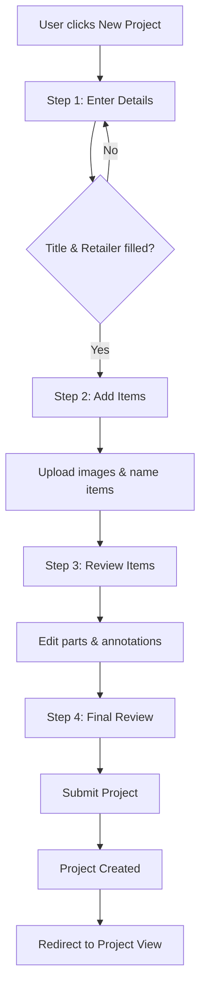
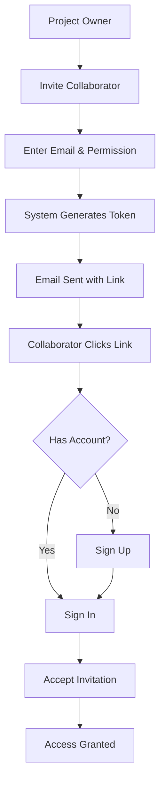

# Chapter 1: Introduction

## What is the Core Render Portal?

The Core Render Portal is an internal business application designed to streamline the management of 3D render projects. It provides a structured, multi-step workflow for creating, organizing, and tracking render requests with detailed specifications for items, parts, and materials.

### The Problem It Solves

In a typical 3D rendering workflow, teams need to:

1. **Collect Requirements**: Gather detailed specifications for products that need to be rendered
2. **Manage Images**: Upload and annotate reference images with specific part callouts
3. **Track Progress**: Monitor the status of multiple render projects
4. **Collaborate**: Share projects with team members and external stakeholders
5. **Document Specifications**: Record finish types, colors, textures, and materials for each part
6. **Visual Planning**: Use whiteboards for collaborative project planning

Without a dedicated tool, teams often resort to:
- Spreadsheets that become unwieldy
- Email chains that lose context
- Disconnected file storage
- Manual tracking systems

The Core Render Portal consolidates all these needs into a single, cohesive application.

---

## Key Features

### 1. Project Management

Create and manage render projects with:
- Project title and retailer information
- Due date tracking
- Multi-item support (multiple products per project)
- Version history and restore capabilities

### 2. Multi-Step Project Creation

A guided, wizard-style form that walks users through:

```
Step 1: Project Details    → Basic project information
Step 2: Add Items          → Products to be rendered
Step 3: Project Overview   → Review and edit items
Step 4: Review & Submit    → Final confirmation
```

### 3. Image Annotation

Interactive image annotation system allowing users to:
- Upload product reference images
- Place annotation markers on specific parts
- Configure part specifications (finish, color, texture)
- Support for multiple images per item

### 4. Collaborative Whiteboard

Built-in whiteboard functionality using Excalidraw:
- Real-time collaborative drawing
- Visual project planning
- Export capabilities (PNG, SVG, JSON)
- Auto-save functionality

### 5. Team Collaboration

Full collaboration features including:
- Project invitation system with email notifications
- Permission levels (view, edit, admin)
- Real-time updates
- Activity logging

### 6. Export Functionality

Multiple export formats:
- PNG images
- SVG vector graphics
- JSON data
- HTML presentations

---

## Target Users

The Core Render Portal is designed for:

| User Type | Use Case |
|-----------|----------|
| **Product Managers** | Create and track render projects |
| **3D Artists** | View specifications and requirements |
| **Design Teams** | Collaborate on visual planning |
| **Project Coordinators** | Monitor progress and deadlines |
| **External Stakeholders** | View project status (read-only) |

---

## Application Structure

The application follows a hierarchical data model:

```
User
└── Projects
    ├── Title, Retailer, Due Date
    ├── Items (products to render)
    │   ├── Name
    │   ├── Hero Image
    │   └── Parts
    │       ├── Name, Finish, Color, Texture
    │       └── Annotation Data (x, y coordinates)
    ├── Collaborators
    │   └── Permission Levels
    ├── Whiteboard
    │   └── Excalidraw Snapshot
    └── History Log
        └── Change Records
```

---

## User Interface Overview

### Landing Page

The landing page provides:
- Clear branding (Core Home Render Portal)
- Sign In option for existing users
- Create Account option for new users
- Modern dark theme design

### Dashboard

After login, users see:
- Project statistics (total, in progress, completed)
- Recent projects grid
- All projects table
- Quick actions (New Project button)

### Project View

Individual project pages include:
- Project details header
- Item gallery with images
- Part specifications
- Whiteboard access
- Collaboration panel
- Export options

---

## Technology Decisions

### Why Next.js 14?

- **Server Components**: Better performance with server-side rendering
- **App Router**: Modern routing with nested layouts
- **API Routes**: Built-in backend capabilities
- **TypeScript**: Type safety out of the box
- **Vercel Integration**: Seamless deployment

### Why Supabase?

- **PostgreSQL Database**: Robust, relational data storage
- **Built-in Auth**: Secure authentication without custom implementation
- **Row Level Security**: Database-level access control
- **Realtime**: Live data synchronization
- **Storage**: File uploads with access policies
- **Open Source**: No vendor lock-in

### Why Excalidraw?

- **Open Source**: No licensing costs
- **Collaborative**: Built for team collaboration
- **Embeddable**: Easy to integrate as a React component
- **Export Options**: Multiple format support
- **Familiar UX**: Intuitive drawing interface

### Why Tailwind CSS?

- **Utility-First**: Rapid styling without leaving HTML/JSX
- **Consistent Design**: Design tokens built-in
- **Dark Mode**: Easy theme implementation
- **Performance**: Purged CSS for small bundles
- **shadcn/ui**: Compatible component library

---

## Project Workflow

### Creating a New Project



### Collaboration Flow



---

## Security Model

The application implements defense-in-depth security:

### Authentication Layer
- Supabase Auth with PKCE flow
- Session management with automatic refresh
- Secure cookie storage

### Authorization Layer
- Row Level Security (RLS) policies
- Permission-based access control
- Project ownership verification

### Data Layer
- Foreign key constraints
- Cascade deletes
- JSONB validation

---

## Scalability Considerations

The architecture supports growth through:

| Component | Scalability Feature |
|-----------|---------------------|
| **Database** | Supabase auto-scaling |
| **File Storage** | CDN-backed storage |
| **Frontend** | Vercel edge deployment |
| **API** | Serverless functions |

---

## What You'll Build

By the end of this documentation, you will have built:

1. A complete Next.js 14 application with TypeScript
2. A PostgreSQL database with 6 interconnected tables
3. A secure authentication system
4. A multi-step form wizard
5. An image annotation system
6. A collaborative whiteboard
7. An invitation and permission system
8. Export functionality to multiple formats
9. A production-ready deployment

---

## Chapter Summary

The Core Render Portal is a comprehensive internal tool that:

- Manages 3D render project workflows
- Enables team collaboration
- Provides image annotation capabilities
- Includes collaborative whiteboard functionality
- Supports multiple export formats

The technology stack (Next.js, Supabase, Excalidraw, Tailwind CSS) was chosen for:
- Developer productivity
- Production reliability
- Cost efficiency
- Maintainability

---

*Next: [Chapter 2: Prerequisites](./chapter-02-prerequisites.md) - Set up your development environment*
