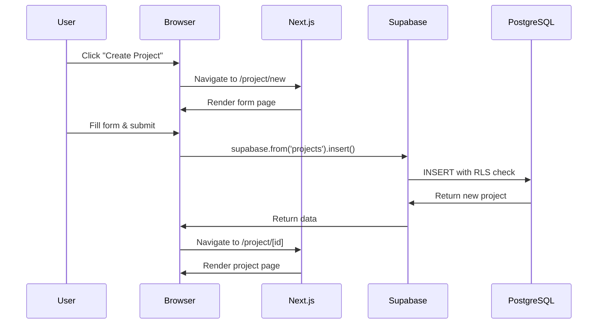
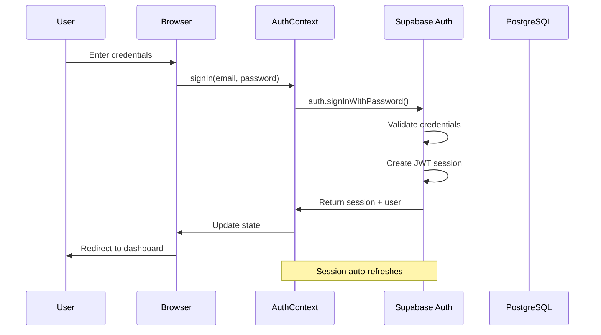
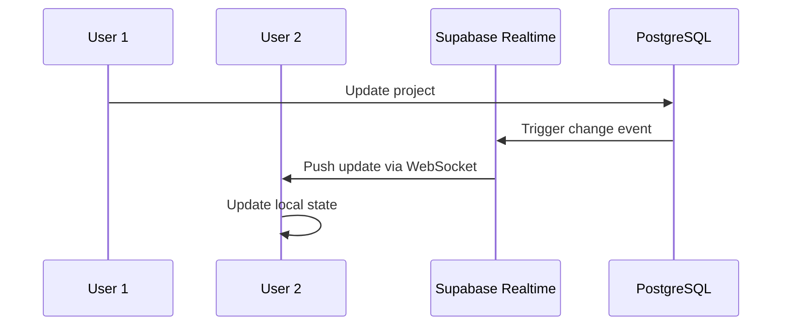
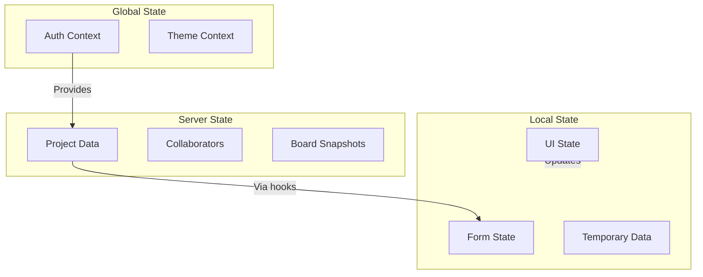
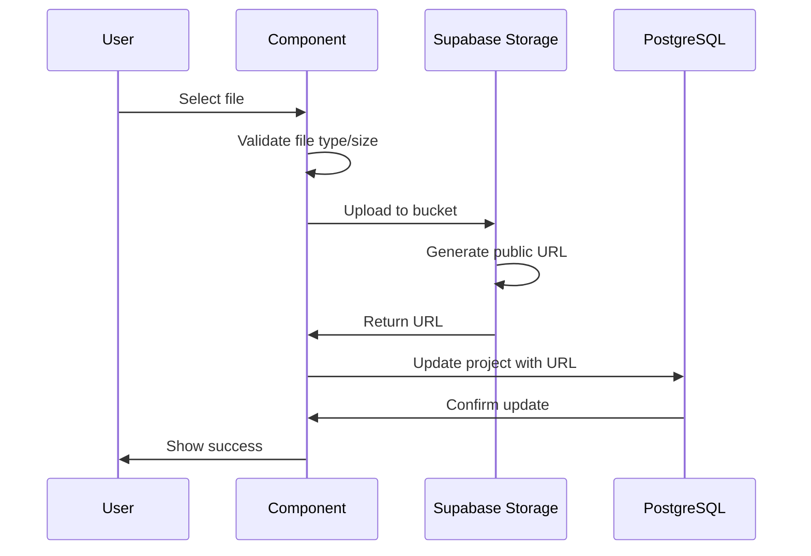

# Chapter 5: Architecture Overview

This chapter provides a comprehensive view of the Core Render Portal's architecture, explaining how all components work together to form a cohesive application.

---

## High-Level Architecture

```
┌─────────────────────────────────────────────────────────────────────────────┐
│                           CLIENT (Browser)                                   │
│                                                                              │
│  ┌─────────────┐  ┌─────────────┐  ┌─────────────┐  ┌─────────────┐       │
│  │   Pages     │  │ Components  │  │   Hooks     │  │  Contexts   │       │
│  │  (app/)     │  │ (components)│  │  (hooks/)   │  │  (lib/)     │       │
│  └──────┬──────┘  └──────┬──────┘  └──────┬──────┘  └──────┬──────┘       │
│         │                │                │                │               │
│         └────────────────┴────────────────┴────────────────┘               │
│                                   │                                         │
│                          Supabase Client                                    │
│                          (lib/supaClient)                                   │
└───────────────────────────────────┼─────────────────────────────────────────┘
                                    │
                         HTTPS / WebSocket
                                    │
┌───────────────────────────────────┼─────────────────────────────────────────┐
│                           SUPABASE CLOUD                                     │
│                                   │                                          │
│  ┌────────────────────────────────┴───────────────────────────────┐         │
│  │                                                                 │         │
│  │   ┌─────────────┐  ┌─────────────┐  ┌─────────────┐           │         │
│  │   │    Auth     │  │  Database   │  │   Storage   │           │         │
│  │   │  (GoTrue)   │  │ (PostgreSQL)│  │  (S3-like)  │           │         │
│  │   └─────────────┘  └──────┬──────┘  └─────────────┘           │         │
│  │                           │                                    │         │
│  │                    ┌──────┴──────┐                            │         │
│  │                    │     RLS     │                            │         │
│  │                    │  Policies   │                            │         │
│  │                    └─────────────┘                            │         │
│  │                                                                │         │
│  │   ┌─────────────┐  ┌─────────────┐                            │         │
│  │   │  Realtime   │  │    Edge     │                            │         │
│  │   │ (WebSocket) │  │  Functions  │                            │         │
│  │   └─────────────┘  └─────────────┘                            │         │
│  │                                                                │         │
│  └────────────────────────────────────────────────────────────────┘         │
│                                                                              │
└──────────────────────────────────────────────────────────────────────────────┘
```

---

## Technology Stack Details

### Frontend Stack

| Technology | Version | Purpose |
|------------|---------|---------|
| **Next.js** | 14.x | React framework with App Router |
| **React** | 18.x | UI component library |
| **TypeScript** | 5.x | Type-safe JavaScript |
| **Tailwind CSS** | 3.x | Utility-first CSS |
| **shadcn/ui** | Latest | Pre-built UI components |
| **Radix UI** | Latest | Accessible primitives |
| **Lucide React** | Latest | Icon library |

### Backend Stack (Supabase)

| Service | Purpose |
|---------|---------|
| **Auth (GoTrue)** | User authentication and sessions |
| **Database (PostgreSQL 15)** | Relational data storage |
| **Storage** | File uploads and serving |
| **Realtime** | Live data subscriptions |
| **Edge Functions** | Serverless functions (optional) |

### Supporting Libraries

| Library | Purpose |
|---------|---------|
| **Excalidraw** | Whiteboard/drawing functionality |
| **React Hook Form** | Form state management |
| **Zod** | Schema validation |
| **Resend** | Email delivery |
| **Vitest** | Unit testing |

---

## Data Flow Architecture

### Request Flow



### Authentication Flow



### Real-time Collaboration Flow



---

## Component Architecture

### Component Hierarchy

```
RootLayout (app/layout.tsx)
├── AuthProvider (lib/auth-context.tsx)
│   └── ThemeProvider (lib/theme-context.tsx)
│       └── Page Components
│           ├── DashboardPage
│           │   └── DashboardLayout
│           │       ├── Sidebar
│           │       └── Main Content
│           ├── ProjectPage
│           │   └── DashboardLayout
│           │       ├── EditProjectForm
│           │       ├── CollaboratorsList
│           │       └── ProjectLogs
│           └── WhiteboardPage
│               └── ExcalidrawBoard
│                   └── Excalidraw
```

### Component Categories

| Category | Location | Purpose |
|----------|----------|---------|
| **Pages** | `app/` | Route handlers, data fetching |
| **UI** | `components/ui/` | Reusable UI primitives |
| **Layout** | `components/layout/` | Page structure components |
| **Feature** | `components/*/` | Feature-specific components |

---

## State Management

### State Types



### State Management Strategy

| State Type | Solution | Example |
|------------|----------|---------|
| **Auth State** | React Context | User session, loading state |
| **Theme State** | React Context | Team colors, preferences |
| **Server State** | Custom Hooks | Projects, collaborators |
| **Form State** | React Hook Form | Multi-step forms |
| **UI State** | useState | Modals, dropdowns |

---

## Database Architecture

### Entity Relationship Diagram

```
┌─────────────────┐     ┌─────────────────────┐     ┌──────────────────────┐
│   auth.users    │     │      projects       │     │  project_invitations │
│─────────────────│     │─────────────────────│     │──────────────────────│
│ id (PK)         │◄────│ user_id (FK)        │────►│ project_id (FK)      │
│ email           │     │ id (PK)             │     │ id (PK)              │
│ created_at      │     │ title               │     │ invited_email        │
│ ...             │     │ retailer            │     │ permission_level     │
└────────┬────────┘     │ items (JSONB)       │     │ invitation_token     │
         │              │ due_date            │     │ invited_by (FK)      │
         │              │ created_at          │     │ expires_at           │
         │              │ updated_at          │     │ accepted_at          │
         │              └──────────┬──────────┘     └──────────────────────┘
         │                         │
         │              ┌──────────┴──────────┐
         │              │                     │
┌────────┴────────┐     │     ┌───────────────┴─────────────┐
│  user_profiles  │     │     │   project_collaborators    │
│─────────────────│     │     │─────────────────────────────│
│ user_id (PK,FK) │     │     │ id (PK)                     │
│ display_name    │     │     │ project_id (FK)             │
│ team            │     │     │ user_id (FK)                │
│ profile_image   │     │     │ permission_level            │
└─────────────────┘     │     │ invited_by (FK)             │
                        │     │ joined_at                   │
                        │     └─────────────────────────────┘
                        │
            ┌───────────┴───────────┐
            │                       │
┌───────────┴───────────┐  ┌───────┴───────────────┐
│     project_logs      │  │    project_boards     │
│───────────────────────│  │───────────────────────│
│ id (PK)               │  │ project_id (PK,FK)    │
│ project_id (FK)       │  │ board_snapshot (JSONB)│
│ user_id (FK)          │  │ created_at            │
│ action                │  │ updated_at            │
│ details (JSONB)       │  └───────────────────────┘
│ timestamp             │
└───────────────────────┘
```

### JSONB Structures

#### projects.items

```typescript
// Each project contains an array of items
interface Item {
  id: string           // UUID
  name: string         // "Living Room Chair"
  hero_image?: string  // URL to image
  parts?: Part[]       // Legacy format
  versions?: Version[] // New version format
}

interface Part {
  id?: string
  name: string         // "Seat Cushion"
  finish: string       // "Matte"
  color: string        // "#FF5500"
  texture: string      // "Leather"
  files?: string[]     // Reference file URLs
  annotation_data?: {
    x: number
    y: number
    id: string
  }
}
```

#### project_boards.board_snapshot

```typescript
// Excalidraw snapshot structure
interface BoardSnapshot {
  elements: ExcalidrawElement[]  // Drawing elements
  appState: {
    viewBackgroundColor: string
    zoom: { value: number }
    scrollX: number
    scrollY: number
  }
  files: Record<string, BinaryFileData>  // Embedded images
}
```

---

## Security Architecture

### Defense in Depth

```
┌─────────────────────────────────────────────────────────────────┐
│                    SECURITY LAYERS                              │
│                                                                 │
│  ┌─────────────────────────────────────────────────────────┐   │
│  │ Layer 1: Authentication (Supabase Auth)                 │   │
│  │ - JWT tokens with PKCE flow                             │   │
│  │ - Session management                                     │   │
│  │ - Automatic token refresh                               │   │
│  └─────────────────────────────────────────────────────────┘   │
│                              │                                  │
│  ┌─────────────────────────────────────────────────────────┐   │
│  │ Layer 2: Row Level Security (PostgreSQL)                │   │
│  │ - Every table has RLS enabled                           │   │
│  │ - Policies check auth.uid() against ownership           │   │
│  │ - Cannot be bypassed from client                        │   │
│  └─────────────────────────────────────────────────────────┘   │
│                              │                                  │
│  ┌─────────────────────────────────────────────────────────┐   │
│  │ Layer 3: Application Logic                              │   │
│  │ - Permission checks in components                       │   │
│  │ - Role-based UI rendering                               │   │
│  │ - Input validation (Zod)                                │   │
│  └─────────────────────────────────────────────────────────┘   │
│                              │                                  │
│  ┌─────────────────────────────────────────────────────────┐   │
│  │ Layer 4: API Route Protection                           │   │
│  │ - Server-side session verification                      │   │
│  │ - Admin client for privileged operations                │   │
│  └─────────────────────────────────────────────────────────┘   │
│                                                                 │
└─────────────────────────────────────────────────────────────────┘
```

### Permission Model

| Role | View | Edit | Admin | Delete |
|------|------|------|-------|--------|
| **Owner** | ✅ | ✅ | ✅ | ✅ |
| **Admin** | ✅ | ✅ | ✅ | ❌ |
| **Edit** | ✅ | ✅ | ❌ | ❌ |
| **View** | ✅ | ❌ | ❌ | ❌ |

---

## File Storage Architecture

### Storage Buckets

| Bucket | Purpose | Access |
|--------|---------|--------|
| `project-images` | Hero images, reference files | Project members |
| `profile-images` | User avatars | Public read |
| `board-assets` | Whiteboard embedded images | Project members |

### Upload Flow



---

## API Architecture

### API Routes

| Route | Method | Purpose |
|-------|--------|---------|
| `/api/send-invitation` | POST | Send invitation emails |
| `/api/notify-collaborators` | POST | Notify about changes |
| `/api/upload` | POST | Handle file uploads |
| `/api/project` | GET/POST | Project operations |
| `/api/request-access` | POST | Request project access |

### API Route Structure

```typescript
// Standard API route pattern
// File: app/api/[route]/route.ts

import { NextRequest, NextResponse } from 'next/server'
import { supabaseAdmin } from '@/lib/supaAdmin'

export async function POST(request: NextRequest) {
  try {
    // 1. Parse request body
    const body = await request.json()
    
    // 2. Validate input
    if (!body.requiredField) {
      return NextResponse.json(
        { error: 'Missing required field' },
        { status: 400 }
      )
    }
    
    // 3. Perform operation
    const { data, error } = await supabaseAdmin
      .from('table')
      .insert(body)
    
    // 4. Handle errors
    if (error) throw error
    
    // 5. Return success
    return NextResponse.json({ success: true, data })
  } catch (error) {
    console.error('API Error:', error)
    return NextResponse.json(
      { error: 'Operation failed' },
      { status: 500 }
    )
  }
}
```

---

## Performance Considerations

### Optimization Strategies

| Strategy | Implementation |
|----------|----------------|
| **Code Splitting** | Next.js automatic per-page bundles |
| **Dynamic Imports** | Excalidraw loaded lazily |
| **Image Optimization** | Next/Image with Supabase CDN |
| **Debouncing** | Whiteboard changes, search inputs |
| **Caching** | React Query-like patterns in hooks |
| **Index Usage** | Database indexes on frequent queries |

### Critical Path

```
User Request → CDN Edge → Next.js Server → Supabase → Response
     │            │            │              │
   ~10ms        ~20ms        ~30ms         ~50ms
                                    
Total Target: < 200ms for data operations
```

---

## Deployment Architecture

```
┌─────────────────────────────────────────────────────────────┐
│                         VERCEL                              │
│                                                             │
│  ┌─────────────────┐  ┌─────────────────┐                 │
│  │  Edge Network   │  │   Serverless    │                 │
│  │   (Static)      │  │   (API Routes)  │                 │
│  └────────┬────────┘  └────────┬────────┘                 │
│           │                    │                           │
│           └────────┬───────────┘                           │
│                    │                                        │
└────────────────────┼────────────────────────────────────────┘
                     │
                     │ HTTPS
                     │
┌────────────────────┼────────────────────────────────────────┐
│                    │       SUPABASE                         │
│  ┌─────────────────┴─────────────────┐                     │
│  │         Connection Pooler          │                     │
│  │         (PgBouncer)               │                     │
│  └─────────────────┬─────────────────┘                     │
│                    │                                        │
│  ┌─────────┬───────┴──────┬──────────┐                     │
│  │   DB    │   Storage    │   Auth   │                     │
│  └─────────┴──────────────┴──────────┘                     │
│                                                             │
└─────────────────────────────────────────────────────────────┘
```

---

## Chapter Summary

The Core Render Portal architecture is built on these principles:

1. **Separation of Concerns**: Clear boundaries between pages, components, hooks, and utilities
2. **Type Safety**: TypeScript throughout with Zod validation
3. **Security First**: Multiple layers of protection (auth, RLS, application logic)
4. **Scalability**: Serverless architecture with managed database
5. **Developer Experience**: Modern tooling, clear patterns, comprehensive types

### Key Takeaways

- **Supabase** handles auth, database, storage, and realtime
- **Next.js App Router** provides the frontend framework
- **Row Level Security** enforces data access at the database level
- **React Context** manages global state (auth, theme)
- **Custom Hooks** encapsulate data fetching and business logic
- **Component Library** (shadcn/ui) provides consistent UI

---

## Part 1 Complete

You now have:

1. Understanding of what the Render Portal does
2. All prerequisites set up
3. A working Next.js project with correct structure
4. Supabase connected and configured
5. Complete understanding of the architecture

---

*Continue to [Part 2: Database & Backend](../part-02-database-backend/README.md) to set up the database schema.*
