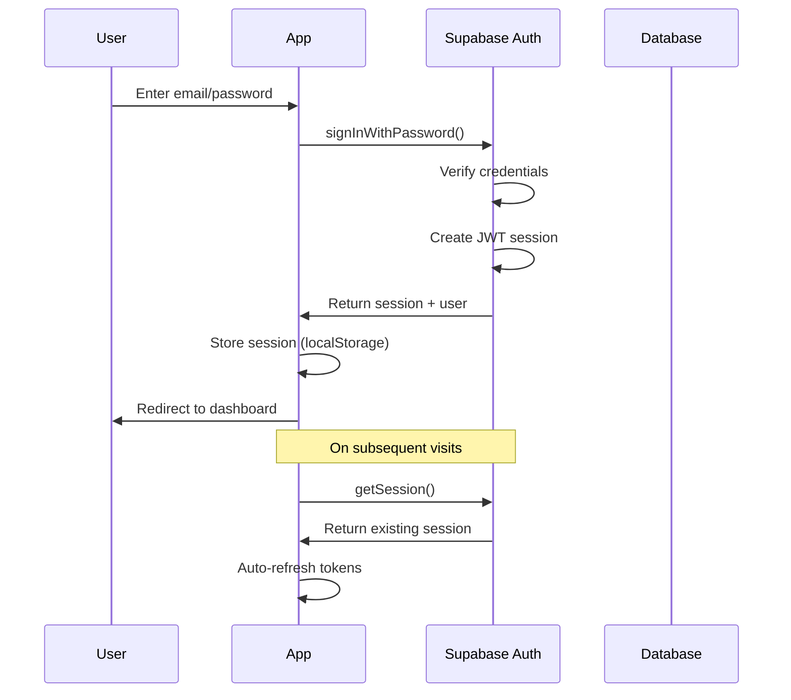

# Chapter 11: Authentication System

This chapter covers implementing user authentication using Supabase Auth, including signup, login, logout, and session management.

---

## Supabase Auth Overview

Supabase Auth provides:

- **Email/Password authentication**: Traditional login with email verification
- **OAuth providers**: Google, GitHub, etc. (optional)
- **Magic links**: Passwordless email login (optional)
- **Session management**: Automatic token refresh
- **PKCE flow**: Secure authentication for SPAs

---

## Authentication Flow



---

## Auth Context Provider

The auth context provides authentication state and methods throughout the application.

### Complete Implementation

```typescript
// File: lib/auth-context.tsx

'use client'

import { createContext, useContext, useEffect, useState } from 'react'
import { User, Session } from '@supabase/supabase-js'
import { supabase } from './supaClient'

/**
 * AuthContext provides authentication state and methods
 * throughout the application.
 */
interface AuthContextType {
  /** Current authenticated user (null if not logged in) */
  user: User | null
  /** Current session with tokens */
  session: Session | null
  /** Loading state during initial auth check */
  loading: boolean
  /** Sign in with email and password */
  signIn: (email: string, password: string) => Promise<{ data: any; error: any }>
  /** Create new account */
  signUp: (email: string, password: string) => Promise<{ data: any; error: any }>
  /** Sign out current user */
  signOut: () => Promise<void>
}

// Create context with undefined default
const AuthContext = createContext<AuthContextType | undefined>(undefined)

/**
 * AuthProvider wraps the application and provides auth state
 * 
 * Usage:
 * ```tsx
 * // In app/layout.tsx
 * <AuthProvider>
 *   {children}
 * </AuthProvider>
 * ```
 */
export function AuthProvider({ children }: { children: React.ReactNode }) {
  // State for user and session
  const [user, setUser] = useState<User | null>(null)
  const [session, setSession] = useState<Session | null>(null)
  const [loading, setLoading] = useState(true)

  useEffect(() => {
    // Set a timeout to prevent infinite loading
    // This handles edge cases where getSession() hangs
    const timeout = setTimeout(() => {
      console.warn('Auth loading timeout - falling back to no user')
      setLoading(false)
    }, 5000) // 5 second timeout

    // Get initial session when component mounts
    supabase.auth.getSession().then(({ data: { session } }) => {
      clearTimeout(timeout)
      setSession(session)
      setUser(session?.user ?? null)
      setLoading(false)
    }).catch((error) => {
      console.error('Auth session error:', error)
      clearTimeout(timeout)
      setLoading(false)
    })

    // Subscribe to auth state changes
    // This handles login, logout, token refresh, etc.
    const {
      data: { subscription },
    } = supabase.auth.onAuthStateChange((event, session) => {
      console.log('Auth state change:', { 
        event, 
        session: !!session, 
        user: !!session?.user 
      })
      setSession(session)
      setUser(session?.user ?? null)
      setLoading(false)
    })

    // Cleanup subscription and timeout on unmount
    return () => {
      clearTimeout(timeout)
      subscription.unsubscribe()
    }
  }, [])

  /**
   * Sign in with email and password
   * 
   * @param email - User's email address
   * @param password - User's password
   * @returns Object with data (session, user) and error
   * 
   * @example
   * ```ts
   * const { data, error } = await signIn('user@example.com', 'password123')
   * if (error) {
   *   console.error('Login failed:', error.message)
   * } else {
   *   // User is now logged in
   *   router.push('/dashboard')
   * }
   * ```
   */
  const signIn = async (email: string, password: string) => {
    const { data, error } = await supabase.auth.signInWithPassword({
      email,
      password,
    })
    
    // Log for debugging
    console.log('Signin response:', { 
      user: data.user, 
      session: data.session, 
      error 
    })
    
    return { data, error }
  }

  /**
   * Create a new user account
   * 
   * @param email - New user's email address
   * @param password - Password (min 6 characters)
   * @returns Object with data (user) and error
   * 
   * Note: By default, Supabase requires email confirmation.
   * Users won't be able to sign in until they confirm their email.
   * 
   * @example
   * ```ts
   * const { data, error } = await signUp('new@example.com', 'securepass')
   * if (error) {
   *   console.error('Signup failed:', error.message)
   * } else {
   *   // Show "check your email" message
   * }
   * ```
   */
  const signUp = async (email: string, password: string) => {
    const { data, error } = await supabase.auth.signUp({
      email,
      password,
    })
    
    console.log('Signup response:', { 
      user: data.user, 
      session: data.session, 
      error 
    })
    
    return { data, error }
  }

  /**
   * Sign out the current user
   * Clears session from browser and invalidates tokens
   */
  const signOut = async () => {
    await supabase.auth.signOut()
    // State updates happen via onAuthStateChange
  }

  // Context value object
  const value = {
    user,
    session,
    loading,
    signIn,
    signUp,
    signOut,
  }

  return (
    <AuthContext.Provider value={value}>
      {children}
    </AuthContext.Provider>
  )
}

/**
 * Hook to access auth context
 * Must be used within AuthProvider
 * 
 * @throws Error if used outside AuthProvider
 * 
 * @example
 * ```tsx
 * function MyComponent() {
 *   const { user, loading, signOut } = useAuth()
 *   
 *   if (loading) return <div>Loading...</div>
 *   if (!user) return <div>Please log in</div>
 *   
 *   return (
 *     <div>
 *       Welcome, {user.email}!
 *       <button onClick={signOut}>Sign Out</button>
 *     </div>
 *   )
 * }
 * ```
 */
export function useAuth() {
  const context = useContext(AuthContext)
  if (context === undefined) {
    throw new Error('useAuth must be used within an AuthProvider')
  }
  return context
}
```

### Code Walkthrough

| Section | Purpose |
|---------|---------|
| `AuthContextType` | TypeScript interface defining available auth methods and state |
| `AuthProvider` | React component that wraps app and provides auth state |
| `useEffect` | Initializes auth state on mount and subscribes to changes |
| `onAuthStateChange` | Listener for auth events (login, logout, token refresh) |
| `signIn` | Wrapper around Supabase signInWithPassword |
| `signUp` | Wrapper around Supabase signUp |
| `signOut` | Wrapper around Supabase signOut |
| `useAuth` | Hook to access auth context in components |

---

## Login Form Component

```typescript
// File: components/auth/login-form.tsx

'use client'

import { useState } from 'react'
import { useRouter } from 'next/navigation'
import Link from 'next/link'
import { useAuth } from '@/lib/auth-context'
import { Button } from '@/components/ui/button'
import { Input } from '@/components/ui/input'
import { Label } from '@/components/ui/label'

export function LoginForm() {
  const router = useRouter()
  const { signIn } = useAuth()
  
  // Form state
  const [email, setEmail] = useState('')
  const [password, setPassword] = useState('')
  const [loading, setLoading] = useState(false)
  const [error, setError] = useState<string | null>(null)

  /**
   * Handle form submission
   */
  const handleSubmit = async (e: React.FormEvent) => {
    e.preventDefault()
    setLoading(true)
    setError(null)

    try {
      const { error: signInError } = await signIn(email, password)
      
      if (signInError) {
        // Handle specific error cases
        if (signInError.message.includes('Invalid login credentials')) {
          setError('Invalid email or password')
        } else if (signInError.message.includes('Email not confirmed')) {
          setError('Please confirm your email before signing in')
        } else {
          setError(signInError.message)
        }
        return
      }
      
      // Success - redirect to dashboard
      router.push('/dashboard')
    } catch (err) {
      setError('An unexpected error occurred')
    } finally {
      setLoading(false)
    }
  }

  return (
    <form onSubmit={handleSubmit} className="space-y-6">
      {/* Error display */}
      {error && (
        <div className="bg-red-900/20 border border-red-500/50 text-red-400 px-4 py-3 rounded-lg">
          {error}
        </div>
      )}
      
      {/* Email field */}
      <div className="space-y-2">
        <Label htmlFor="email" className="text-white">
          Email
        </Label>
        <Input
          id="email"
          type="email"
          value={email}
          onChange={(e) => setEmail(e.target.value)}
          placeholder="you@example.com"
          required
          disabled={loading}
          className="bg-[#0d1117] border-gray-700 text-white"
        />
      </div>
      
      {/* Password field */}
      <div className="space-y-2">
        <Label htmlFor="password" className="text-white">
          Password
        </Label>
        <Input
          id="password"
          type="password"
          value={password}
          onChange={(e) => setPassword(e.target.value)}
          placeholder="••••••••"
          required
          disabled={loading}
          className="bg-[#0d1117] border-gray-700 text-white"
        />
      </div>
      
      {/* Submit button */}
      <Button
        type="submit"
        disabled={loading}
        className="w-full bg-[#38bdbb] hover:bg-[#2ea9a7] text-white"
      >
        {loading ? (
          <>
            <div className="w-4 h-4 border-2 border-white border-t-transparent rounded-full animate-spin mr-2" />
            Signing in...
          </>
        ) : (
          'Sign In'
        )}
      </Button>
      
      {/* Sign up link */}
      <p className="text-center text-sm text-gray-400">
        Don't have an account?{' '}
        <Link href="/auth/signup" className="text-[#38bdbb] hover:underline">
          Sign up
        </Link>
      </p>
    </form>
  )
}
```

---

## Signup Form Component

```typescript
// File: components/auth/signup-form.tsx

'use client'

import { useState } from 'react'
import { useRouter } from 'next/navigation'
import Link from 'next/link'
import { useAuth } from '@/lib/auth-context'
import { Button } from '@/components/ui/button'
import { Input } from '@/components/ui/input'
import { Label } from '@/components/ui/label'

export function SignupForm() {
  const router = useRouter()
  const { signUp } = useAuth()
  
  const [email, setEmail] = useState('')
  const [password, setPassword] = useState('')
  const [confirmPassword, setConfirmPassword] = useState('')
  const [loading, setLoading] = useState(false)
  const [error, setError] = useState<string | null>(null)
  const [success, setSuccess] = useState(false)

  const handleSubmit = async (e: React.FormEvent) => {
    e.preventDefault()
    setError(null)

    // Validate passwords match
    if (password !== confirmPassword) {
      setError('Passwords do not match')
      return
    }

    // Validate password strength
    if (password.length < 6) {
      setError('Password must be at least 6 characters')
      return
    }

    setLoading(true)

    try {
      const { data, error: signUpError } = await signUp(email, password)
      
      if (signUpError) {
        if (signUpError.message.includes('already registered')) {
          setError('An account with this email already exists')
        } else {
          setError(signUpError.message)
        }
        return
      }
      
      // Check if email confirmation is required
      if (data.user && !data.session) {
        // Email confirmation required
        setSuccess(true)
      } else if (data.session) {
        // Auto-confirmed (dev mode) - redirect
        router.push('/dashboard')
      }
    } catch (err) {
      setError('An unexpected error occurred')
    } finally {
      setLoading(false)
    }
  }

  // Success state - show confirmation message
  if (success) {
    return (
      <div className="text-center space-y-4">
        <div className="w-16 h-16 bg-green-500/20 rounded-full flex items-center justify-center mx-auto">
          <svg className="w-8 h-8 text-green-400" fill="none" viewBox="0 0 24 24" stroke="currentColor">
            <path strokeLinecap="round" strokeLinejoin="round" strokeWidth={2} d="M5 13l4 4L19 7" />
          </svg>
        </div>
        <h2 className="text-xl font-semibold text-white">Check your email</h2>
        <p className="text-gray-400">
          We've sent a confirmation link to <strong className="text-white">{email}</strong>
        </p>
        <p className="text-sm text-gray-500">
          Click the link in your email to activate your account.
        </p>
        <Link href="/auth/login">
          <Button variant="outline" className="mt-4">
            Back to Sign In
          </Button>
        </Link>
      </div>
    )
  }

  return (
    <form onSubmit={handleSubmit} className="space-y-6">
      {error && (
        <div className="bg-red-900/20 border border-red-500/50 text-red-400 px-4 py-3 rounded-lg">
          {error}
        </div>
      )}
      
      <div className="space-y-2">
        <Label htmlFor="email" className="text-white">Email</Label>
        <Input
          id="email"
          type="email"
          value={email}
          onChange={(e) => setEmail(e.target.value)}
          placeholder="you@example.com"
          required
          disabled={loading}
          className="bg-[#0d1117] border-gray-700 text-white"
        />
      </div>
      
      <div className="space-y-2">
        <Label htmlFor="password" className="text-white">Password</Label>
        <Input
          id="password"
          type="password"
          value={password}
          onChange={(e) => setPassword(e.target.value)}
          placeholder="••••••••"
          required
          disabled={loading}
          className="bg-[#0d1117] border-gray-700 text-white"
        />
        <p className="text-xs text-gray-500">Minimum 6 characters</p>
      </div>
      
      <div className="space-y-2">
        <Label htmlFor="confirmPassword" className="text-white">Confirm Password</Label>
        <Input
          id="confirmPassword"
          type="password"
          value={confirmPassword}
          onChange={(e) => setConfirmPassword(e.target.value)}
          placeholder="••••••••"
          required
          disabled={loading}
          className="bg-[#0d1117] border-gray-700 text-white"
        />
      </div>
      
      <Button
        type="submit"
        disabled={loading}
        className="w-full bg-[#38bdbb] hover:bg-[#2ea9a7] text-white"
      >
        {loading ? 'Creating account...' : 'Create Account'}
      </Button>
      
      <p className="text-center text-sm text-gray-400">
        Already have an account?{' '}
        <Link href="/auth/login" className="text-[#38bdbb] hover:underline">
          Sign in
        </Link>
      </p>
    </form>
  )
}
```

---

## Login Page

```typescript
// File: app/auth/login/page.tsx

import { LoginForm } from '@/components/auth/login-form'

export default function LoginPage() {
  return (
    <div className="min-h-screen bg-[#070e0e] flex items-center justify-center px-4">
      <div className="w-full max-w-md">
        {/* Header */}
        <div className="text-center mb-8">
          <h1 className="text-3xl font-bold text-[#38bdbb] mb-2">
            Core Home
          </h1>
          <div className="h-1 w-32 bg-gradient-to-r from-[#38bdbb] to-[#f9903c] mx-auto rounded-full mb-4" />
          <h2 className="text-xl text-white">Welcome Back</h2>
          <p className="text-gray-400">Sign in to your account</p>
        </div>
        
        {/* Form card */}
        <div className="bg-[#1a1e1f] rounded-2xl p-8">
          <LoginForm />
        </div>
      </div>
    </div>
  )
}
```

---

## Protected Routes

To protect pages that require authentication:

```typescript
// Pattern for protected pages
'use client'

import { useEffect } from 'react'
import { useRouter } from 'next/navigation'
import { useAuth } from '@/lib/auth-context'

export default function ProtectedPage() {
  const { user, loading } = useAuth()
  const router = useRouter()

  useEffect(() => {
    // Redirect to login if not authenticated
    if (!loading && !user) {
      router.push('/auth/login')
    }
  }, [user, loading, router])

  // Show loading while checking auth
  if (loading) {
    return (
      <div className="flex items-center justify-center min-h-screen">
        <div className="animate-spin w-8 h-8 border-2 border-primary border-t-transparent rounded-full" />
      </div>
    )
  }

  // Don't render content if not authenticated
  if (!user) {
    return null
  }

  // Render protected content
  return (
    <div>
      {/* Page content */}
    </div>
  )
}
```

---

## Session Refresh

Supabase handles token refresh automatically, but you can manually check:

```typescript
// Manual session refresh
const { data: { session }, error } = await supabase.auth.refreshSession()

// Check if session is expired
const isExpired = session?.expires_at 
  ? new Date(session.expires_at * 1000) < new Date() 
  : true
```

---

## Chapter Summary

Authentication system provides:

1. **AuthProvider** - Wraps app with auth state
2. **useAuth hook** - Access auth in any component
3. **Login/Signup forms** - Complete UI components
4. **Protected routes** - Pattern for auth-required pages
5. **Session management** - Automatic token refresh

Key patterns:
- Check `loading` before making auth decisions
- Redirect unauthenticated users to login
- Handle all error cases in forms
- Use context for global auth state

---

*Next: [Chapter 12: User Management](./chapter-12-user-management.md) - Profiles and settings*
